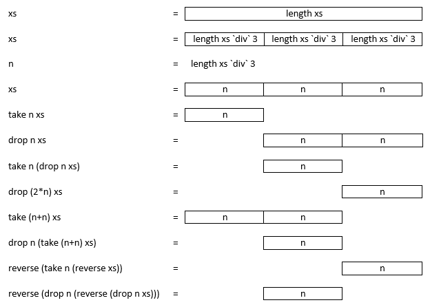

## Setup

### How do I open GHCi?

Just open a terminal window and simply type `ghci` to open the Glasgow Haskell Compiler in interactive mode.

In the computer labs in the Gateway building you need to log into Linux where Haskell is already installed. If you want to install Haskell on your laptop or home computer you can download it [here](https://www.haskell.org/). Alternatively, if you just quickly want to try an expression but don’t have Haskell installed on your computer at home, you can use the interactive prompt on [haskell.org](https://www.haskell.org/) or [tryhaskell.org](http://tryhaskell.org/). There is even an app for iOS devices ([Raskell](http://slidetocode.com/raskell)). **Let me know if you find a good app for Android!**


### What’s the point of `:set +t`?

Setting this will show the type of any value returned. It is optional but useful. You will have to set this every time you restart GHCi. Don’t forget to type the `:` at the start of the expression. In some of the examples throughout the lab sessions you will encounter instructions telling you to type `:s +t` which might not work on your machine. Use `:set +t` instead.

### Setting up your GHCi config file

You may want to setup a config file on your profile which can save you typing out certain commands every time you start a new session. For example you can put the `:set +t` command into this file and you will never have to remember it again.

To do this, open your home folder on Linux and enable the viewing of hidden files. Find the `.ghc` folder. You need to create a new file called `ghci.conf` within that folder. Now, open this file and simply type in `:set +t` and save.

There are various other things you can do with this config file. For example you can change the prompt from `Prelude>` to your name or the Haskell “logo” lambda (`λ`) using this command: `:set prompt "λ>"`.

If you have installed GHC on your laptop or home computer you may have noticed that `:set +t` produces slightly different results than on the Gateway Linux lab machines. This is due to the version you are using.

In the labs (which use version 7.4.1) you would see something like this:

```haskell
> 4 + 6
10
it :: Integer
```

If you installed the newest version of GHC (7.10.3) then you will see this instead:

```haskell
> 4 + 6
10
it :: Num a => a
```

Right now this might not mean much to you, so you can change this setting in your `ghci.conf` file (see above) by adding this command: `:set -XMonomorphismRestriction`. To change it back to what it was before change the command to: `:set -XNoMonomorphismRestriction`.

An example `ghci.conf` file can look like this:

```haskell
:set +t
:set -XMonomorphismRestriction
:set prompt "λ> "
```

### Some other useful commands for GHCi

- `:quit` or `:q` to leave your current GHCi session
- `:! clear` to clear your terminal window within an GHCi session

### Hoogle

Don’t forget you can check what functions do in [Hoogle](https://www.haskell.org/hoogle/?hoogle=floor): floor. For example, you can also search for functions by their type declarations: `String -> Int` [Hoogle: String -> Int](https://www.haskell.org/hoogle/?hoogle=String+-%3E+Int).

### How do I load scripts into GHCi?

Once you have typed a few expressions into a text editor of your choice and saved the file with an `.hs` extension, you can load it into GHCi.

First you need to make sure your terminal prompt is in the right directory. Use the `cd` command to enter the folder where you saved the Haskell script. So, if you called your file `Script101.hs` and saved it in a folder called `CTEC1901` within your home directory, you need to enter the following commands into your terminal prompt: `cd CTEC1901`, then `ghci` and then `:load Script101.hs`.

```bash
~$ cd CTEC1901
~/CTEC1901$ ghci
Prelude> :load Script101.hs
*Main>
```

- Script names are case sensitive!
- `:reload` or `:r` to reload a script
- `:load` or `:l` to load a script
- You need to be in the correct directory
- `:cd` to change directory within GHCi
- You don’t have to type the file extension `.hs`

### How do I use script files and functions?

Let’s assume you have a script file which contains the following code:

```haskell
add x y = x + y
```

You can call this function in GHCi by loading the script and then typing:

```haskell
add 4 6
```

which should then return:

```haskell
10
it :: Integer
```

Similarly if your file contained the following code:

```haskell
add :: (Int, Int) -> Int
add (x,y) = x + y
```

Then you need to type the following to call the function:

```haskell
add (4,6)
```

Note that the first line in your script `add :: (Int, Int) -> Int` tells you which types of values you need to pass to the function as parameters. In this case the left hand side (before the `::`) tells you that the function is called `add` and the right hand side tells you that the function takes a **tuple** of two Integers `(Int, Int)` as input (before the `->`) and that the output of the function is an `Int` (after the `->`).

[back up](#)

---


## Expressions

### Div and mod aren’t working?

The expressions ``x `div` y`` and ``x `mod` y`` need **backwards quotes** (left of the ‘1’ key on the keyboard). Note that the above notation is just syntactic sugar for `div x y` and `mod x y` - you can interchange them as you like.

### What do `floor` and `ceiling` do?

`floor x` returns the greatest integer not greater than x and similarly, `ceiling x` returns the least integer not less than x. So `floor 1.4` will return `1` and `ceiling 1.4` will return `2`. This is different from rounding!

### How does `1 + if 2==2 then 3 else 4` work?

The `if` statement automatically takes precedence over the addition:

```haskell
1 + if 2 == 2 then 3 else 4
1 + ( if 2 == 2 then 3 else 4 )
1 + ( if True then 3 else 4 ) 
-- 2 == 2 is True so we enter the `then` statement
1 + ( 3 )
1 + 3
4
```

### How does `(if 2/=2 then reverse else tail) "abc"` work?

Here, the `if` statement determines which function to apply to the string `"abc"`. Since 2 is ***not*** not equal to 2, it’s `False` and the function performs `tail "abc"` and returns `"bc"`.

### Why does `two * length name` produce an error?

In this particular example, the variable `two` is defined as `2` in your script which Haskell interprets as having type `Integer`. You can test this by using the `:type` or `:t` command: 

```haskell
:t two
two :: Integer
```

`name` is defined as a String `"Haskell"` (of type`[Char]`). The function `length` returns an `Int` (see [here](https://www.haskell.org/hoogle/?hoogle=length)), so `length name` will return an `7` of type `Int`.<br>Now, the multiplication function `*` requires you to call it with two values of the **same numeric type** (see [here](https://www.haskell.org/hoogle/?hoogle=%28*%29)). But we have seen that GHCi interprets the value `two` as an `Integer` rather than an `Int`. Therefore trying to multiply it with  `length name` (which returns an `Int`) GHCi will return an error:

```bash
Couldn’t match expected type `Integer’ with actual type `Int’
In the return type of a call of `length’
In the second argument of `(*)’, namely `length name’
In the expression: two * length name
```

On the other hand, if you type `2 * length name` into your terminal it will return `14` of type `Int`. That is because manually typing a number into GHCi will default to an `Int`.
One way around this would be to convert the two parts of the evaluation to the same type. For example you can convert an `Int` to an `Integer` by using the `fromIntegral` function (see [here](https://www.haskell.org/hoogle/?hoogle=fromIntegral)).

```haskell
two * fromIntegral (length name)
14
it :: Integer
```

Or using the `fromInteger` function (see [here](https://www.haskell.org/hoogle/?hoogle=fromInteger)) similarly:

```haskell
fromInteger two * length name
14
it:: Int
```

[back up](#)

---


## Curry, Lamda and Sections
  
See page 64 of David Smallwoods [tutorial file](https://vle.dmu.ac.uk/bbcswebdav/pid-3025849-dt-content-rid-4603139_1/courses/CTEC1901_2015_Y/tut.pdf#page=72). The following examples are taken from [wunki.org](https://wunki.org/posts/2011-10-04-currying-and-partial-application.html)

### Curried and uncurried functions

**Uncurried** function:

```haskell
fooU :: (Int, Int) -> Int
fooU (x, y) = x * y
```

**Curried** function:

```haskell
fooC :: Int -> Int -> Int
fooC x y = x * y
```

The main difference *in very simple terms* is that the function parameters `x` and `y` are given separately in curried functions compared to a tuple in uncurried functions `(x,y)`.

### Anonymous / Lamda functions

Lamda functions are sometimes called anonymous functions because they are not given a name.

```haskell
fooA :: Int -> Int -> Int
fooA x = \y -> x * y
```

Note that the type signature indicates that the function takes 2 input parameters of type Int, even though in the function expression it only lists 1 of them as `x`.

```haskell
> let foo x = \y -> x * y
> foo 2 3
6
```

### Sections / Partial application

> “Partial function application is the ability to take a function of many parameters and apply arguments to some of the parameters to create a new function that needs only the application of the remaining arguments to produce the equivalent of applying all arguments to the original function.” 
> ([Source](http://rosettacode.org/wiki/Partial_function_application) & [Code examples](http://rosettacode.org/wiki/Partial_function_application#Haskell))

Consider the following example:

```haskell
sumTwo x y = x + y
addSeven = sumTwo 7
```

The second line is equivalent to:

```haskell
addSeven = \y -> 7 + y
```

and:

```haskell
addSeven y = sumTwo 7 y
```

[back up](#)

---


## Tuples and Lists

### What is the difference between *tuples* and *lists*?

Lists are sequences of elements of the **same type**. They are enclosed by square brackets and separated by commas. E.g. `[1,2,3]` or `[’a’,’c’,’b’]`.

It is possible to have **infinite lists**, for example `[1,3..]` will produce the list of all odd numbers from 1 to infinity. If you type that into your terminal, remember you can interrupt a process by pressing `ctrl c`.

Tuples are **finite** sequences of elements of possibly different types. They are enclosed by round brackets and separated by commas. E.g. `(1, "Hello")` or `(True, False)`.

Examples:

- `[1..9]`
- `([1..9], [’a’..’z’])`
- `[[1,3,5,7,9], [0,2,4,6,8]]`
- `(True, [1..])`
- `((1, True), (0, False))`
- `[(’a’, 1), (’b’, 2)]`
- `(1, 2)`

### Why do Strings have the type [Char]?

Because in Haskell Strings are interpreted as a **list of characters**. This allows you to perform list functions like `head` and `tail` on Strings:

```haskell
head "Haskell"
’H’
it :: Char
```

```haskell
tail "Haskell"
"askell"
it :: [Char]
```

Also, this means that if you type in lists of characters into GHCi it will return them as strings of type `[Char]`.

```haskell
[’H’,’a’,’s’,’k’,’e’,’l’,’l’]
"Haskell"
it :: [Char]
```

[back up](#)

---


## Types, Polymorphism and Order of Execution

### What is the meaning of `:t`?

`:t` is short for `:type` and returns the type definition of a function. E.g.:

```haskell
:t sum
sum :: Num a => [a] -> a
```

This is different from the `:set +t` command which sets GHCi to automatically return the type of an output from an expression (for the current session only though - so you have to set that every time you restart GHCi).

### What are function types?

In general a function type definition has the following structure.

- To the left of the `::` you find the **name** of the function,
- to the left of the `->` arrow you find the given type for the functions **input** parameters and
- then on the right of the `->` arrow you find the type of the **output** value

```haskell
functionName :: InputType -> OutputType
```

### What is the difference between `add :: Int` and `add :: Num a => a`?

In short, the first is more specific than the second.

```haskell
add :: Int -> Int -> Int -> Int
add x y z = x + y + z
```

Calling this function with `Ints` will work fine:

```haskell
add 1 2 3
6
it :: Int
```

But trying to call it with any other kinds of numbers will not work:

```bash
add 1.4 2.6.3.0
No instance for (Fractional Int) arising from the literal `1.4’
In the first argument of `add’, namely `1.4’
In the expression: add 1.4 2.6 3.0
In an equation for `it’: it = add 1.4 2.6 3.0
```

If your `add` function has the specific kind of type definition then trying to run `add 1.4 2.6.3.0` returns an error for example. This is because you have told Haskell that your function only works with `Ints`. If you use the more generic (**polymorphic** and **overloaded**) type definition however, then you’d get the result.

```haskell
add :: Num a => a -> a -> a -> a
add x y z = x + y + z
```

```haskell
add 1 2 3
6
it :: Num a => a
```

```haskell
add 1.4 2.6.3.0
7.0
it :: Fractional a => a
```

### What are *polymorphic* and *overloaded* functions again?

A function is **polymorphic** if it takes values that can have **more than one type**. See David Smallwood’s tutorial [here](https://vle.dmu.ac.uk/bbcswebdav/pid-3025849-dt-content-rid-4603139_1/courses/CTEC1901_2015_Y/tut.pdf#page63). For example, `length` is defined polymorphically. In this case `a` is a **type variable** and represents any type. The function therefore takes a list of any type of value (`[Int]`, `[[Char]]`, `[(Double, Bool)]`, etc) but then specifically returns an `Int`.

```haskell
length :: [a] -> Int
```

A polymorphic function is called **overloaded** if its type contains one or more **class constraints**. For example, the sum function takes a list `[a]` as input and returns a value of type `a` but this time `a` has to be of a *class of numeric types*. The numeric class (`Num`) contains all sorts of types: (`Int`, `Integer`, `Float`, `Double`, `Fractional`, etc) (See [Prelude#t:Num](http://hackage.haskell.org/package/base-4.7.0.2/docs/Prelude.html#t:Num)).

```haskell
sum :: Num a => [a] -> a
```

```haskell
sum [1,2,3]
6
it :: Num a => a
```

```haskell
sum [2.5, 3, 4.5]
10.0
it :: Fractional a => a
```

- To the left of the `::` you find the **name** of the function,
- between the `::` and the `=>` you find the **class constraint**,
- to the left of the `->` arrow you find the given type for the functions **input** parameters and 
- then on the right of the `->` arrow you find the type of the **output** value

`functionName :: ClassConstraint => InputType -> OutputType`.

Other type classes include `Eq` for equality (see [Prelude#t:Eq](http://hackage.haskell.org/package/base-4.7.0.2/docs/Prelude.html#t:Eq)) and `Ord` for orderable datatypes (see [Prelude#t:Ord](http://hackage.haskell.org/package/base-4.7.0.2/docs/Prelude.html#t:Ord)). E.g.:

```haskell
(+)  :: Num a => a -> a -> a
(==) :: Eq a => a -> a -> Bool
(<)  :: Ord a => a -> a -> Bool
```

See also the LearnYouAHasekll chapter on types [here](http://learnyouahaskell.com/types-and-typeclasses).

### What is the meaning of `’` in function names?

Often in the examples you will have encountered functions with a `’` at the end like `add’` vs. `add`. There is no specific meaning to this other than to give the function a slightly different name. We could have equally called it `add1` or `anotherAdd` to set it apart from the first `add` function we defined.<br>You might want to review Haskell [naming conventions](https://wiki.haskell.org/Programming_guidelines#Naming_Conventions).

### In which order is `mult x y z` evaulated?

> “the `->` operator is right associative, and function application is left associative” ([Source](https://wiki.haskell.org/Partial_application))

Because function application is left associative, `mult x y z` gets evaluated as `((mult x) y) z`.

```haskell
mult :: Int -> Int -> Int -> Int
mult x y z
```

But remeber that the `->` operator is right associative, hence the function definition really looks something like this.

```haskell
mult :: Int -> (Int -> (Int -> Int))
((mult x) y) z
```

You don’t have to add these parenthesis, but you should know that this is the default order of evaluation!

[back up](#)

---


## Functions

### How do I write a function from scratch?

In the first exercise we are asked to write a function that splits a list into two halves. We are given the function’s **type signature** as a starting point.

```haskell
halve :: [a] -> ([a],[a])
```

Let’s start filling in the bits we know, e.g. we know the name of the function (`halve`) and that the output is structured as a **tuple**.

```haskell
halve :: [a] -> ([a],[a])
halve = (   ,   )
```

*Note that this won’t run - GHCi will return an error because it’s an incomplete function!*

Next, we know the input to the function is a list of polymorphic type, so we know that we will be able to call this function in GHCi like this:  

```haskell
halve [1,2,3,4,5,6]
```

and it should return a result like this:

```haskell
([1,2,3],[4,5,6])
```

Because the function is polymorphic we can also call it with `Char` types for example:

```haskell
halve [’a’,’b’,’c’,’d’]
```

which would return:

```haskell
("ab","cd")
```

Also, because “lists of `Chars`” are synonymous to `Strings` we can call the function with a `String` like this:

```haskell
halve "Haskell"
```

which would return:

```haskell
("Has","kell")
```

**Now, let’s get back to writing our function by filling in the gaps of `halve  = (   ,   )`.**

We know from the **type signature** `halve :: [a] -> ([a],[a])` that there is one input parameter of type `[a]` and one output tuple of type `([a],[a])`.

$$
\definecolor{blue}{RGB}{181,204,227}
\text{halve} \ {\underbrace{\qquad\qquad\qquad} \atop \color{blue}\small\text{input parameter}} \ = \ ( {\underbrace{\qquad\qquad\qquad} \atop \color{blue}\small\text{first half}} \ , \ {\underbrace{\qquad\qquad\qquad} \atop \color{blue}\small\text{second half}} \ )
$$

Let’s call the input parameter `xs`: *remember the convention to put an `s` on variables that represent lists!*

```haskell
halve xs = (   ,   )
```

Next, let’s think of how to get the **first half** of `xs`. How do we know what *half* of the input list is? Well, it’s the total length of `xs` divided by `2`, right?

```haskell
length xs `div` 2
```

Let’s give this value a name (`n`) so that we can use it in our function by writing it into a `where` statement in a new line and slightly indented (this is important).

```haskell
halve :: [a] -> ([a],[a])
halve xs = (   ,   )
      where n = length xs `div` 2
```

Now we can define the two halves in our output tuple using the `take` and `drop` functions from the **Standard Haskell Prelude** (which is loaded into GHCi by default and we don’t have to manually import the library).  

Since `n` now represents the length of half the input list `xs` we can **take the first n elements in the list xs** which translates into Haskell like this: `take n xs`. Similarly we can **drop the first n elements from the list xs** to get the second half: `drop n xs`.

The complete function then looks like this:

```haskell
halve :: [a] -> ([a],[a])
halve xs = ( take n xs , drop n xs )
      where n = length xs `div` 2
```

### How do I split a list into three parts?

We can use a similar approach to the `halve` function explained above.

```haskell
split3 :: [a] -> ([a],[a],[a])
split3 xs = (   ,   ,   )
      where n = length xs `div` 3
```

Using `take` and `drop` and a variable `n` which represents a *third* of the length of `xs` we can create the various parts of our output tuple as such:



So our final solution could be this (note from the table above that there are various options on how to extract the three thirds of the input list):

```haskell
split3 :: [a] -> ([a],[a],[a])
split3 xs = ( take n xs , take n (drop n xs) , drop (n*2) xs )
      where n = length xs `div` 3
```

### What are the different kinds of techniques for writing functions?

There are various techniques in Haskell for writing functions and expressions. Some of them are fairly similar in style to other languages and others are quite different. Deciding when to use one technique over another depends on the purpose of the function.

- [Functions](https://vle.dmu.ac.uk/bbcswebdav/pid-3025849-dt-content-rid-4603139_1/courses/CTEC1901_2015_Y/tut.pdf#page=67)
- [Anonymous functions / lambda functions](https://vle.dmu.ac.uk/bbcswebdav/pid-3025849-dt-content-rid-4603139_1/courses/CTEC1901_2015_Y/tut.pdf#page=67)
- [Naming functions](https://vle.dmu.ac.uk/bbcswebdav/pid-3025849-dt-content-rid-4603139_1/courses/CTEC1901_2015_Y/tut.pdf#page=68)
- [Structured Parameters](https://vle.dmu.ac.uk/bbcswebdav/pid-3025849-dt-content-rid-4603139_1/courses/CTEC1901_2015_Y/tut.pdf#page=71)
- [Curried functions / partial function application](https://vle.dmu.ac.uk/bbcswebdav/pid-3025849-dt-content-rid-4603139_1/courses/CTEC1901_2015_Y/tut.pdf#page=72)
- [Associativity](https://vle.dmu.ac.uk/bbcswebdav/pid-3025849-dt-content-rid-4603139_1/courses/CTEC1901_2015_Y/tut.pdf#page=73)
- [`let` / `where` expressions](https://vle.dmu.ac.uk/bbcswebdav/pid-3025849-dt-content-rid-4603139_1/courses/CTEC1901_2015_Y/tut.pdf#page=75)
      - `let x = 3 in x * x + x`
      - `let x = 3 in let y = 4 in x + y`
      - `let {x = 3; y = 4} in x + y`
      - `let x = not True in if x then x else not x`
      - `let {s = "One"; t = "Two"} in length s + length t`
      - `f (x,y) = let m = (x + y)/2 in (x-m, y-m)`
      - 
```haskell
f (x,y) = s/p
where s = x + y
p = x * y
```
- `if`/`then`/`else` statements
      - `if True then "bc" else "de"`
      - `1 + if 2/=2 then 3 else 4`
      - `(if 2/=2 then reverse else tail) "abc"`
- [Guarded equations](https://vle.dmu.ac.uk/bbcswebdav/pid-3025849-dt-content-rid-4603139_1/courses/CTEC1901_2015_Y/tut.pdf#page=69)
      - 
```haskell
sign x 
      | x < 0  = -1
      | x == 0 = 0
      | x > 0  = 1
```
      - `sign x | x < 0  = -1 | x == 0 = 0 | x > 0  = 1`
- [`case` statements](https://vle.dmu.ac.uk/bbcswebdav/pid-3025849-dt-content-rid-4603139_1/courses/CTEC1901_2015_Y/tut.pdf#page=76)
      - 
```haskell
foo a = case a of
(0,ys)      -> 0
(x,(y:ys))  -> y
(x,[])      -> x
```
- [Recursion](https://vle.dmu.ac.uk/bbcswebdav/pid-3025849-dt-content-rid-4603139_1/courses/CTEC1901_2015_Y/tut.pdf#page=70)
      - `fib n = if n == 0 then 1 else if n == 1 then 1 else fib (n-1) + fib (n-2)`

- [Pattern matching](https://vle.dmu.ac.uk/bbcswebdav/pid-3025849-dt-content-rid-4603139_1/courses/CTEC1901_2015_Y/tut.pdf#page=76)

      - 
```haskell
fib 0 = 1
fib 1 = 1
fib n = fib (n-1) + fib (n-2)
```
      -
```haskell
foo (0,ys) = 0
foo (x,(y:ys)) = y
foo (x,[]) = x
```

### Functions

Functions have a name and usually one or more input parameters. There is only ever one output. The type signature of a function is optional when writing functions in a script - Haskell can derive it by itself - but it is good practice to include the type signature as a form of documentation.

```haskell
add :: Num a => a -> a > a -> a
add x y z = x + y + z
```

```haskell
add 1 2 3
6
```

E.g.

$$
\definecolor{blue}{RGB}{181,204,227}
\underbrace{ \ \text{add} \ }_{\color{blue}\small\text{function name}} ::
\underbrace{\ \text{Num a} \Rightarrow \ }_{\color{blue}\small\text{class constraint}} 
\underbrace{\ \text{a} \rightarrow \ }_{\color{blue}\small\text{input 1}} 
\underbrace{ \ \text{a} \rightarrow \ }_{\color{blue}\small\text{input 2}}
\underbrace{ \ \text{a} \rightarrow \ }_{\color{blue}\small\text{input 3}}
\underbrace{ \ \text{a} \ }_{\color{blue}\small\text{output}}
$$

$$
\definecolor{blue}{RGB}{181,204,227}
\underbrace{ \ \text{add} \ }_{\color{blue}\small\text{function name}} \ 
\underbrace{ \quad \text{x} \quad }_{\color{blue}\small\text{input 1}} \ 
\underbrace{ \quad \text{y} \quad }_{\color{blue}\small\text{input 2}} \ 
\underbrace{ \quad \text{z} \quad }_{\color{blue}\small\text{input 3}} \ 
\underbrace{ \qquad\quad \text{=} \qquad\quad }_{\color{blue}\small\text{assignment operator}} \ 
\underbrace{ \ \text{x+y+z} \ }_{\color{blue}\small\text{output}} 
$$

The **class constraint** is optional, and there can be `0` or more **input parameters** but always one **result**.

### Anonymous functions

Anonymous functions or lambda functions are **nameless** functions. This allows us to declare them on the fly. The structure is as follows.

$$
\definecolor{blue}{RGB}{181,204,227}
\underbrace{ \ \text{\\} \ }_{\color{blue}\small\text{lambda}} \ 
\underbrace{ \quad \text{x} \quad }_{\color{blue}\small\text{input}} \ 
\underbrace{ \qquad \rightarrow \qquad }_{\color{blue}\small\text{assignment operator}} \ 
\underbrace{ \ \text{x*2} \ }_{\color{blue}\small\text{output}} 
$$

Instead of a function name we now have the **lambda** symbol (a backslash in Haskell) `\` and instead of the normal **assignment operator** `=` we use the `->` symbol.

Similar to normal functions, we can use various techniques within a lamda expression and have more than one parameter. For example:

- `\x -> 2 * x`
- `\x y -> x + y`
- `\x y z ->  (x - 1/z) + y`
- `\x y z -> if x then y + z else y - z`

We can use lamda expressions as inputs for the `map` function:

```haskell
map (\x -> if x == 1 then 0 else 1) [1,0,1,0,0,0,1,1]
[0,1,0,1,1,1,0,0]
```

```haskell
map (\(x,y) -> x + y) [(1,2),(2,3),(4,5)]
[3,5,9]
```

[back up](#)

---


## List comprehensions

### List comprehensions definition

List comprehensions are defined in the [official documentation](https://www.haskell.org/onlinereport/exps.html#sect3.11) as:
**`[ e | q1, ..., qn ]`**  
where `n>=1` and the `qi` qualifiers are either

- **generators** of the form `p <- e`, where `p` is a pattern of type `t` and `e` is an expression of type `[t]`
- **guards**, which are arbitrary expressions of type `Bool`
- **local bindings** that provide new definitions for use in the generated expression e or subsequent guards and generators using `let` notation.

See also David’s tutorial on [page 84](https://vle.dmu.ac.uk/bbcswebdav/pid-3025849-dt-content-rid-4603139_1/courses/CTEC1901_2015_Y/tut.pdf#page=92).

### List comprehensions vs loops

In pseudo C using for-loops:

```c
for ( int x = 1; x <= 4; x++ ) {
      for ( int y = 1; y <= 2; y++ ) {
            //add (x,y) to myList
      }
}
```

In Haskell:

```haskell
myList = [(x,y) | x <- [1..4], y <- [1,2]]
```

```haskell
ghci> mylist
[(1,1),(1,2),(2,1),(2,2),(3,1),(3,2),(4,1),(4,2)]
```

### Infinite lists

Example taken from [haskell.org](https://wiki.haskell.org/List_comprehension):

```haskell
ghci> take 5 [ (i,j) | i <- [1,2], j <- [1..]] 
[(1,1),(1,2),(1,3),(1,4),(1,5)]
```


> “each successive generator refines the results of the previous generator. Thus, if the second list is infinite, one will never reach the second element of the first list.” [Source](https://wiki.haskell.org/List_comprehension)

So, because the second generator (the *inner loop*) `[1..]` produces an infinite list, this list comprehension theoretically creates an infinite list of tuples: `[(1,1),(1,2),(1,3),(1,4),(1,5),(1,6),(1,7),(1,8),(1,9),(1,10),..` etc. The first value of the tuple (`i`) is never incremented because we infinitely increment the second one (`j`) first.

The whole expression however asks only for the first 5 elements (`take 5`) of the infinite list that is being generated through the list comprehension.

### Set Notation

Examples taken from [Wikipedia](http://en.wikipedia.org/wiki/List_comprehension#Overview):
In mathematics, set notation looks like this:  

$$
\definecolor{blue}{RGB}{181,204,227}
S = \{ \ 2 \cdot x \ | \ x \in \mathbb{N}, \ x^2 > 3 \ \}
$$

This means:

$$
\definecolor{blue}{RGB}{181,204,227}
S = \{ \underbrace{ \ 2 \cdot x \ }_{\color{blue}\text{output expr.}} \ | \ \underbrace{ \ x \ }_{\color{blue}\text{variable}} \in \underbrace{ \ \mathbb{N} \ }_{\color{blue}\text{input set}}, \ \underbrace{ \ x^2 > 3 \ }_{\color{blue}\text{predicate}} \}
$$

In [Haskell](http://en.wikipedia.org/wiki/List_comprehension#Haskell) this translates directly into:

```haskell
s = [ 2*x | x <- [0..], x^2 > 3]
```

This reads something like:  
“for each x from 0 to infinity: if x^2 is larger than 3 then return 2*x”

- `2*x` is the **output expression**
- `|` separates the output expression from the generators, guards and local bindings
- `x <- [0..]` is the **generator**
- `x^2 > 3` is the **guard** condition

### More List comprehension examples

**if-then-else statements within the list comprehension:**

Taken from: [learnyouahaskell.com](http://learnyouahaskell.com/starting-out#im-a-list-comprehension)

```haskell
boomBangs xs = [ if x < 10 then "BOOM!" else "BANG!" | x <- xs, odd x]
```

```haskell
ghci> boomBangs [7..13]  
["BOOM!","BOOM!","BANG!","BANG!"]
```

**Nested List comprehensions:**
```haskell
ghci> let xxs = [[1,3,5,2,3,1,2,4,5],[1,2,3,4,5,6,7,8,9],[1,2,4,2,1,6,3,1,3,2,3,6]]  
ghci> [ [ x | x <- xs, even x ] | xs <- xxs]  
[[2,2,4],[2,4,6,8],[2,4,2,6,2,6]]
```

**Local bindings using let expressions:**

Taken from: [learnyouahaskell.com](http://learnyouahaskell.com/syntax-in-functions#let-it-be)

```haskell
calcBmis :: (RealFloat a) => [(a, a)] -> [a]  
calcBmis xs = [bmi | (w, h) <- xs, let bmi = w / h ^ 2]
```

```haskell
calcBmis :: (RealFloat a) => [(a, a)] -> [a]  
calcBmis xs = [bmi | (w, h) <- xs, let bmi = w / h ^ 2, bmi >= 25.0]
```

### Lecture example

```haskell
positions :: Eq a => a -> [a] -> [Int]
positions x xs =
      [i | (x’,i) <- zip xs [0..n], x == x’]
      where n = length xs - 1
```

We can run this function as follows:

```haskell
ghci> positions 0 [1,0,0,1,0,1,1,0]
[1,2,4,7]
```

To understand this function, let’s look at the list comprehension. Remember the expression around the left pointing arrow `<-` is called a **generator**. 

The generator of this list comprehension (`(x’,i) <- zip xs [0..n]`) creates a list of type `[(x’,i)]` by *zipping* `xs` and `[0..n]` together. We are calling the function `positions` with `x` as `0` and `xs` as `[1,0,0,1,0,1,1,0]` and `n` is locally defined using the `where` notation as the length of our list `xs` minus `1`. The length of `xs` is `8`, therefore `n` must be `7`. This means that the generator will zip these two lists together:  

```haskell
zip [1,0,0,1,0,1,1,0] [0,1,2,3,4,5,6,7]
```

which returns:

```haskell
[(1,0),(0,1),(0,2),(1,3),(0,4),(1,5),(1,6),(0,7)]
```

Each of those tuples in this list is of type `(x",i)`. Now, the list comprehension states that we are only interested in those elements of the list where `x` is equal to `x"`. This is called the **guard** expression and is separated from the **generator** by a single comma. Remember that `x` is `0`. This means we can delete any elements of the list where `x"` is not equal to `0`. We are then left with:

```haskell
[(0,1),(0,2),(0,4),(0,7)]
```

The list comprehension also states that the type of our output list should be `[i]` (the bit before `|` in the list comprehension), that means we can discard all `x"` in our list of tuples `[(x",i)]` so that we are left with only the `i`:

```haskell
[1,2,4,7]
```

[back up](#)

---


## Guards and map

### Guarded equations

Here is an example of a guarded equation:

```haskell
sign :: (Ord a, Num a) => a -> Int
sign x 
      | x &lt; 0      = -1
      | x == 0     =  0
      | otherwise  =  1
```

This is very similar to mathematical notation:  

$$
\text{sign}(x) = 
\begin{cases}
-1  & \quad \text{if } x < 0\\
0   & \quad \text{if } x == 0\\
1   & \quad \text{otherwise}
\end{cases}
$$

To write the `zoe` function we need to put the three specified cases into this *guarded* notation. If the input parameter `x` is `0` then we want to return `0`; if `x` is odd we want to return `1` and if `x` is even we return `2`. Putting what we know so far into code is easy:

```haskell
zoe :: (Integral a, Num a) => a -> Int
zoe x
      | "if x is equal to 0 return 0"
      | "if x is odd then return 1"
      | "if x is even then return 2"
```

These statements obviously need to be replaced with the appropriate conditional statements in Haskell. 

`"if x is equal to 0 return 0"` can be written as `x == 0 = 0`. Checking if a number is even or odd can be done in two ways: we can either use the Standard Haskell Prelude functions `odd` and `even`, or we can use `mod` (for example, if the remainder of a number divided by `2` is `0` then the number must be **even**; if the remainder is `1` then it must be **odd**).

```haskell
zoe :: (Integral a, Num a) => a -> Int
zoe x
      | x == 0 = 0
      | odd x  = 1
      | even x = 2
```

or

```haskell
zoe :: (Integral a, Num a) => a -> Int
zoe x
      | x == 0    = 0
      | odd x     = 1
      | otherwise = 2
```

or

```haskell
zoe :: (Integral a, Num a) => a -> Int
zoe x
      | x == 0         = 0
      | x `mod` 2 == 1 = 1
      | x `mod` 2 == 0 = 2
```

### How do I use the `map` function?

> “`map f xs` is the list obtained by applying `f` to each element of `xs`” [Source](http://hackage.haskell.org/package/base-4.7.0.2/docs/Prelude.html#v:map)

The `map` function has the following type signature:

```haskell
map :: (a -> b) -> [a] -> [b]
```

which means it takes a function of type `(a -> b)` as the first input parameter and a list of type `[a]` as the second. The function returns a list of type `[b]`.

Now that you have seen **recursive functions** you should be able to understand the actual function definition of `map`.

```haskell
map :: (a -> b) -> [a] -> [b]
map _ []     = []
map f (x:xs) = f x : map f xs
```

We can run this function like this:

```haskell
map (+1) [1,2,3,4,5,6]
[2,3,4,5,6,7]
```

It evaluates recursively like this:

```
map (+1) [1,2,3,4,5,6]
= (+1) 1 : map (+1) [2,3,4,5,6]
= 2 : (+1) 2 : map (+1) [3,4,5,6]
= 2 : 3 : (+1) 3 : map (+1) [4,5,6]
= 2 : 3 : 4 : (+1) 4 : map (+1) [5,6]
= 2 : 3 : 4 : 5 : (+1) 5 : map (+1) [6]
= 2 : 3 : 4 : 5 : 6 : (+1) 6 : map (+1) []
= 2 : 3 : 4 : 5 : 6 : 7 : []
= [2,3,4,5,6,7]
```

Note also that when providing the `map` function with an **anonymous function** as the first input parameter, then we can shorten that as such:

$$
\definecolor{blue}{RGB}{181,204,227}
\definecolor{salmon}{RGB}{250, 128, 114}
\definecolor{normal}{RGB}{162,153,161}
\text{map} \ (\underbrace{\color{salmon} \backslash x \rightarrow x}_{\color{blue}\text{not needed}} \color{normal} + 7) \ [1..10]
$$

### Why does `const flip id const 3 id 4` return `4`?

Because the expression is evaluated from **left to right** and functions can be input to functions. The three functions are defined as follows:

```haskell
id    = (\x -> x)
const = (\x y -> x)
flip  = (\f x y -> f y x)
```

The expression `const flip id const 3 id 4` evaluates as such:

$$
\definecolor{blue}{RGB}{181,204,227}
\definecolor{normal}{RGB}{162,153,161}
\begin{matrix}
& const & flip & id         & const & 3 & id & 4 \\
= \ & ( \color{blue}const\color{normal} & \underbrace{flip}_{\color{blue}x} & \underbrace{id}_{\color{blue}y}) & const & 3 & id & 4 \\
= \ & & ( \color{blue}flip\color{normal} & & \underbrace{const}_{\color{blue}f} & \underbrace{3}_{\color{blue}x} & \underbrace{id}_{\color{blue}y}) & 4 \\
= \ & & & & ( \color{blue}const\color{normal} & \underbrace{id}_{\color{blue}x} & \underbrace{3}_{\color{blue}y}) & 4 \\
= \ & & & & & & ( \color{blue}id\color{normal} & \underbrace{4}_{\color{blue}x}) \\
= & & & & & & & 4
\end{matrix}
$$

[back up](#)