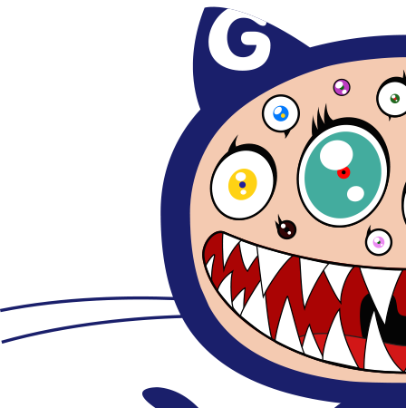
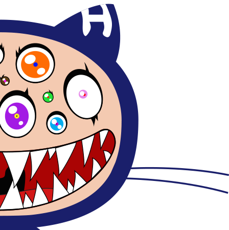
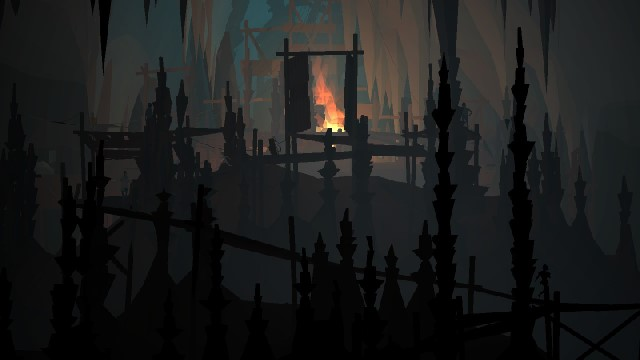

<section class="content"> <!-- articles -->

	<h2>Blogy-Wogy</h2>

	<article>
		<h3>Monday 20 February 2017</h3>
		
I'm redesigning this site.

	</article>

	<article>
		<h3>Saturday 14 March 2015</h3>
		
I'm a bit fan of Nicolas Bernier's work.

		
	</article>

	<article>
		<h3>Saturday 14 March 2015</h3>
		

		
	</article>

		<!--<article>
		
 Friday 25 July 2014</h3>
		
&nbsp;

		
&nbsp;

		
&nbsp;

		
&nbsp;

		
&nbsp;

		
&nbsp;

		
&nbsp;

		
&nbsp;

		
&nbsp;

		
&nbsp;

		 

 
		
&nbsp;

		
&nbsp;

		
&nbsp;

		
&nbsp;

		
&nbsp;

		
&nbsp;

		
&nbsp;

		
&nbsp;

		
&nbsp;

		
&nbsp;

		 

 
		
&nbsp;

		
&nbsp;

		
&nbsp;

		
&nbsp;

		
&nbsp;

		
&nbsp;

		
&nbsp;

		
&nbsp;

		
&nbsp;

		
&nbsp;

		 

 
		
&nbsp;

		
&nbsp;

		
&nbsp;

		
&nbsp;

		
&nbsp;

		
&nbsp;

		
&nbsp;

		
&nbsp;

		
&nbsp;

		
&nbsp;

		

		 
	</article> -->

	<article>
		<h3>Tuesday 29 July 2014</h3>
		

		
	</article>

	<article>
		<h3>Monday 14 July 2014</h3>
		

		

		

		
		

		

		
		

		

		

	</article>

	<article>
		<h3>Tuesday 08 July 2014</h3>
		

		
	</article>

	<article>
		<h3>Saturday 05 July 2014</h3>
		

		
	</article>

	<article>
		<h3>Someday Day June 2014</h3>
		

		
	</article>

	<article>
		<h3>Someday Day June 2014</h3>
		

		
	</article>

	<article>
		<h3>Someday Day June 2014</h3>
		

		

		<a href="http://www.marlborotech.com/Zalgo.html" target="_blank" title="Couldn't think of anything clever to say.">
			Ḭ̵ͦͣ͒̒̃̎̿̀ ̯́͗̏̍ͩ̽͊̌͞h̪͎̜̞̫̲̑̿̋ͫͩa̜͚̠͈͚͚̳͋̈̋̏̎̋̾ͯ͝ţ̩̜͕͎̂͂̽ͪ̎e̷̬̫͖͍̓ͬ̒͟͞ ̷̗̞̮̪̘̼͎̪̮̎ͬ̑̇̐͐b̛̞̬̤̣̱ͣ͒͊͡e̥̠̤̐ͧͬͬ͋i̴̪̩̙̱͍̼̟̗̋̎̕n̯̈́̂̌ͤ͛̈́̓̇͟͞g̴̨̮͎̰͎̈ͫ̅ͫ ̨̫̪̟̩̜̗̎͆͑͛̆̎ͬ̉̚͘s̴̩̞̮̓̊̒͊͒̏ͮ̃i͈̳̗͉͓̬̰͑ͫ͞c̬͔̮̼̅͆ͧ̿̇͐̃̇k͓͍̬̞̬̞̊̃̆̿̄͋ͣ̓ͅ.̃ͮͨ͏̣͎ ̵̪̳͕̲̫̓̿ͮ͑̐̃̐̅ͤ͢͞I̩̰̞̜̮̓̄͂͊̌ͦ̾́͘ ̰̪̖̈́h̶̼̠̲̘̻̼͊ͦ̑̈͗ͩ̐̀͘͢a̛̼̬ͥͩ̅̋ͧť̡ͨ́͛̈́͑͏͚̜̞̞̜̣̱͙̳e̶̮͎̳ͬͭ̈́̿̒̾̚ ̹̳̠̻̟ͥͦb̨̦̲̲̝͎͕ͨ̃e͖͚̘͍̓͒̑̋̉͗͛̅ͭ́i̵̢͉̣̘̺̝̻͖͊ͣ̄͛ͬn͚͉̪̜͇̋̒ͪͤ̒̍́͝ͅg̶̲̥̟̦͕͙͚͕̋̇̇̑ͩ ͛ͩͬͤ̆̄̉ͨ̚͏̵̛̣̜̰͔d͉̱̠̭̙͕ͭ͌̉͗̕ͅe̬̤̳̤̠̮ͥ̐̓͂̎͋ͮ̅͘p̳̯̏ͩͯͯͩͯ̄̕ṛ͙͍̰̱̫̘̩̑́ͨ̐̌̄̅́ȇ̳͖͖̝̦̗̦̼̬ͣͦ̃ͤ̀͆͊̋́͘s̷̥̙͈̦̦͐̂̿̓ͤ̀̌͢͟sͫ̅́̋̂̎͏̸͖͉̗̳̮̝̯̳ė̕͢҉͍̟̭̘̺̳͖d̸̖̩̱ͫ̆̅̀͘.̫̤̝̱͉̓̉͑
			̧̉̃ͪ̽͜҉̯̰̜̣͎I̶̵̼̱̋͋͒̆̃̓͂́ ̹͙͈̫̯̠̲ͪ̈ͭ̌w̵̟̻̭̹͉̻͖̻͗̓͆ͩ̊ͨ̽ͨ̕͞ͅaͩ͂̓͏̶̬̺̘̰̜͖̖͟ͅņ̈̓͌̑̔͂̂ͥ̀͏͉͈̟͇̲͚͚̻t̤̗̋ͮ̽͑̀͋͘ ̰̹͈̼͈̏́́͜ť̵̸̙̼͆ǫ͈͔͉̯̗̩̬̖̑͐͌̄̐ͨͥ̚ ̘͕͎̺̍̑͂̕͝b̢̠̜͉͆͛ͯ͆͂̍̋̿͘e̩̣̳͇̻ͬ͗͌̾͑̓̏ͩͯ ̵̟̹͓͌̽ͩͦ̕ͅh̹͖̠̯̅̐̍͋͛̈́͐ͅḁ̮͙̫̠̽̅̓̋p̸̻̞̭̯̫̬͎̰̄͒͆ͫͯ̀p̰͓̊̋͆̃ͦỹ̛̯͖̘͍̅̎͛̂͆͂̈́ͪ̕.̥̳̭̗͙͋̎ͫ
			̘̼͔̙̙̙̲ͭͫI̧̛̙̮̦͔͇̭̬̠̋͛̈ͧ͐̿̾̕ ̵̬̳̭̪̱͕̺̰̔́w̶̼̱̞̩͖̘̯̞͓̽͢a̴̧̼̳͔͉̖͖ͥͩ̊̐n̵̢̪ͯ͒̈́̂̓ͮt̄̌̔̎̾ͧͭͨ҉͈̜ ̵̸̗ͦ̉ͪ̓̇͌ͯ̕ț̢̝͓̭͔̱͍̙͙̈́̓̎ͥ̎o̸̘̞ͬ͢ ̵̳̖̘͈̐̇̾͒̃̇ͥ̿̽b̧̳̩̫͍͉̖̘̦ͬͣ̓̑̋̔̈̿͑e̤̘ͫ̌̀̊͛̏́̕.̪͎̭̪̪͗ͭ̄͂͗ͯ̀ͅ
			̵̺̅͋͋͛M̓͛ͤ͑҉̠ė̷̬̤̰͓͍͓͗̿̇̆ͤ.̟̩̘̘̭͐̆
			̪̓͆̀Ḯ̢͖ͪͪ̂ͬ̾̇̏̚͟ ̖̯͍̯̮̱̘͐̓̌̂͂̈̉͂͡͠ͅl̢͙̺͔ͧ͗̾ͮ̿̔͛̔ͅo̶̱̹̗͙̭ͩ̔ͧͣ͗ͨ̿̓vͬ̌͏̗͍̦̱̞̘͟e̳̭͓͎͆͘ ̵̭̲̣̤̐́ͮ̄ͯͤ͐ͨ͟c̸̛̲͎̞͇̥͌͘a͖̘̱͖̻̘̗ͪ̓̃͑͋̄́́lͯ͊͏̲̼̬̣͡m̷̹̣̯̜͌ͦ̎͗̉̿̈͘͡.̛̦̝̲͍ͣ̆͟ ̵̉ͭ͂҉̱I̧̻͖̬̰̜ͭͤ͠ ̨̖̲̹̮̩̥̥̞̤͐͝ļ̴̙̤͎̥̺ͭͥ̅̌̐̀͛ͅo̷̼̠̖͙̟͎̞̩̊̔v͉̖̮̜̭͉͉̐̈́͛̽͆ͨe̋́ͩͩ͏̶͍̱͚ ̸̯̦̭͍̱̫͚̻͒͊͌̐̓͒͒͒̓̕ͅn̵̘̝̣̝̭͓ͧ̓̿ͅȃ̶̸̮̲͕ͥ̉́t̬̣̞͎̥͖͎̟ͫͩͭ̿̓͢ư̶̟͕̺͔ͩͧ͂̀ͧͪr̵̸͖͍͔̊ͣ͗́͆e̵̥̤̦̖̘ͩ̅ͬ̂ͯ́͢.͙̫̞͖̏ͧ͒̒́͠
			̙͈̻̌ͧ̀̿̋ͦ̌̄̚͜I̷͙̤̪̪ͨ͌͐͐́ͫ́ ̴͉̤̫̠̪̠̹̪͈͂̈́̀m̧̺̙̳̖̹̈̑̋͐̎̉̎͗i̶̖̹̦͆͛ͥͧ̓ͯͣ͡s̟͖̮̺͚̻̹̮̉̿̐ͩ̌̆̊͑ͯ͝ͅș̰͕͎̣ͭ́͢ ̼͙̼ͨ̃̍́͘ć̣̪̠͉̼͛ͪͩ̇͑́h͈̖̐ͩ̅ͨͥ̌͑̍͘ā̷̶͖̩͇̻̼͎̀ͬ͘ͅô̸͓̖̹̋̓͜s̯̭͒̓ͥ͐̆̆̒̀.̴͖ͮ͌̓ͭ̄ͨͨ͠ ͖͎̜̰͌̍̃̾̆̔ͩȈ͂҉̨̲ ̠͔͖̖̫ͥ̄m̷̶̯̞͈̄ͨ̕i̶̷̼̟͈͇̦̪ͪͫͤ̿̈ͤͦͫ̑s͍̭͉͖̙͎̤̫̉̋̆s̢̟͙͇ͯ̈́̔̀͝ ̶̼̱̫̥̩̱̣̣ͮ̌̅̃͋ͩ̈́͟ͅs̡͖̥̹̦͔̜̜̍͛ͮ͐ͥ͂̔̒t͖̦̦̰͉̍̐̊ͫ͊r̉ͫ͒̓̄ͨͧ͏̛̟̞̬̖͚̭̣ͅu̧͈̼̖̭̫̜̦ͪ̎̑̿͛c̗̠̪̜̼̣̳̿̌ͤ̎ͭţ̰̗̾̓̑ͫ̆̄͞ư̡̥̰̮̹̼̱̠ͦ̍̈́̆ͨ̒̽̒͘r͛ͣ͋ͩ̉ͪͥ̎͏̺̪͞ě͈̖͕̔͞.̴̡͙̮̅ͧͦ̂̉̋ͣ
			̴̷̡͎͑̽͒͒̔ͧ̚Ḭ͇͌̓̃͟ ̫̻̅ͬ͂ͤ͠l͓̫̠ͮͬ̽ͥͩ͜͟o͓͓̟͓̜̝̪̟̞͌͌v̛̹͖̹̓̓̒̓́͟e̦͉̜͕ͦ̊͐͟ ̶̭͔̜̳̯̹ͫ̂͒̀͞ͅy̰̠̜̝̻̩̰̣̅̄ͨͅó͚̱̪̫͓͂̂͐͗͗̌ͥu̟̦̫̣͉͇̭̙̦ͨͤ̃ͯ̚̚͟.̧̡̖̺̱̞̫͆̑͐
			̬̖̜̤̏̌́͂̄
		</a>
		

	</article>

	<article>
		<h3>Someday Day June 2014</h3>
		

		
	</article>

	<article>
		<h3>Someday Day June 2014</h3>
		

		<a href="http://www.ioccc.org/2011/goren/hint.html" target="_blank" title="My all h3 favorite obfuscation.">Uri Goren:</a>
	<pre><code>
typedef unsigned char t;t*F="%c",l[]="|\\/=_ \n](.\0(),*(.(=(}*.)[[*.",N='\n',*
r;typedef(*H)();extern H Ar;Q(a){return(a|-a)>>31;}H S(c,a){return(H)(a&~c|(int
)Ar&c);}extern t*ist;V(t*u){*u^=*u&2^(*u>>7)*185;}Z(t*u,t n){*u-=n;}e(t c,H h){
R(h,Q(*                                                                 r^c));}
I(){r=l                                                                 +7-4*Q(
getchar                                                                 ()^*l);
}R(H h,                int                                              c){Ar=S
(c,h);-                main()                                           ;}P(){r
++;}z()                {                                                O(&N);}
O(t*c){                    printf(                                      F,+*c);
}T(){r=                        "This is not a function\n"               ;}w(U){
U=Z(r,8                    );                                           r-=~Q(*
r/8-4);	                   return 0;                                    }M(){r=
ist-68;                }                                                h(){t G
=r[1]-r                                                                 [2]^*r;
G^=30;V                                                                 (&G);e(
0,(O(&G                                                                 ),P(P(*
r++)),z));}g(){M();R(h,0);}f(){P(O(r));e('f',g);}p(){P();e('a',f);}d(){P(O(r));
e('n',p);}c(u){u=r[-2];T(Ar=d);R(f,Q(u^'"'));}n(){e(w(O(l+*r%8)),c);}a(){I();R(
n,0);}main(){S(Q(Ar),a)();}H              Ar;t*ist="Rene Magritte"-(1898-1967);
	</code></pre> 
	</article>

	<article>
		<h3>Someday Day June 2014</h3>
		

		
	</article>

</section> <!-- end of articles -->

<section class="links"> <!-- links -->

	<h2>Linky-Winky</h2>

	<dl>

		<dt><a href="http://butdoesitfloat.com/" class="h3link ext" target="_blank">butdoesitfloat</a></dt>
		<dd>More arts stuff.  I could get lost in there.</dd>

		<dt><a href="http://earth.nullschool.net/#current/wind/surface/level/orthographic=-57.35,-87.84,407" class="h3link ext" target="_blank">earth.nullschool.net</a></dt>
		<dd>Very relaxing.  Screensaver worthy.</dd>

		<dt><a href="http://www.windmaedchen.com/" class="h3link ext" target="_blank">Windmaedchen</a></dt>
		<dd>2D Animation. Illustration.  Game Design. Artist. Sister.</dd>

		<dt><a href="http://50watts.com/" class="h3link ext" target="_blank">50 Watts</a></dt>
		<dd>Book design & illustration.</dd>

		<dt><a href="http://www.ubu.com/" class="h3link ext" target="_blank">Ubu Web</a></dt>
		<dd>Avant-garde, ethnopoetics   & outsider art.</dd>

		<dt><a href="http://translationparty.com/" class="h3link ext" target="_blank">Translation Party</a></dt>
		<dd>翻訳パーティー。  Huh, what?</dd>

		<dt><a href="https://www.ukiyoeheroes.com/" class="h3link ext" target="_blank">Ukiyo-e Heroes</a></dt>
		<dd>Woodblock prints.  Japanese style.</dd>

		<dt><a href="http://www.streetartutopia.com/" class="h3link ext" target="_blank">Street Art Utopia</a></dt>
		<dd>I'm running out.  Of things to say.</dd>

		<dt><a href="http://legacy.python.org/dev/peps/pep-0020/" class="h3link ext" target="_blank">PEP 20</a></dt>
		<dd>The Zen of Python.  Should apply to everything.</dd>

		<dt><a href="http://regexcrossword.com/" class="h3link ext" target="_blank">Regex Crossword</a></dt>
		<dd>Nerd crossword.  Happy procrastinating.</dd>

		<dt><a href="http://foulomatic.hnldesign.nl/" class="h3link ext" target="_blank">Foul-o-Matic</a></dt>
		<dd>Insult, swear & curse  word generator.</dd>

		<dt><a href="http://labs.teehanlax.com/project/painting-with-a-digital-brush" class="h3link ext" target="_blank">Ascii Street View</a></dt>
		<dd>Real-h3 Ascii Art.  Somebody fix this plx!</dd>

		<dt><a href="http://www.evergreenreview.com/102/fiction/duo.html" class="h3link ext" target="_blank">Ballard vs Jarry</a></dt>
		<dd>Considered as an even  website race.</dd>

		<dt><a href="http://www.jasondavies.com/wordtree/?source=6fb6d66f4f8531c29ba39a541b9d7856&prefix=Ha%20&reverse=0&phrase-line=0" class="h3link ext" target="_blank">Word Tree</a></dt>
		<dd>Wordtree of Faustroll  Ha Ha.</dd>

		<dt><a href="http://www.langorigami.com/art/creasepatterns/creasepatterns_gallery.php" class="h3link ext" target="_blank">Origami</a></dt>
		<dd>Origami crease patterns   by Robert Lang.</dd>

		<dt><a href="http://sciencevsmagic.net/fractal/#1080,0625,6,3,0,1,1" class="h3link ext" target="_blank">Fractal Machine</a></dt>
		<dd>Fractals.  Beautiful.</dd>

		<dt><a href="http://www.koalastothemax.com/" class="h3link ext" target="_blank">Koalas to the max!</a></dt>
		<dd>Minimal Koala</dd>

		<dt><a href="http://algo-rythmics.ms.sapientia.ro/" class="h3link ext" target="_blank">Algorythmics</a></dt>
		<dd>Algorithms  and Music.</dd>

		<dt><a href="http://gif-iti.tumblr.com/" class="h3link ext" target="_blank">Gif-iti</a></dt>
		<dd>Gifs.  Grafiti.</dd>

		<dt><a href="http://www.koalastothemax.com/" class="h3link ext" target="_blank">Koalas to the max!</a></dt>
		<dd>Minimal Koala</dd>

		<dt><a href="http://algo-rythmics.ms.sapientia.ro/" class="h3link ext" target="_blank">Algorythmics</a></dt>
		<dd>Algorithms  and Music.</dd>

	</dl>

</section> <!-- end of links -->
