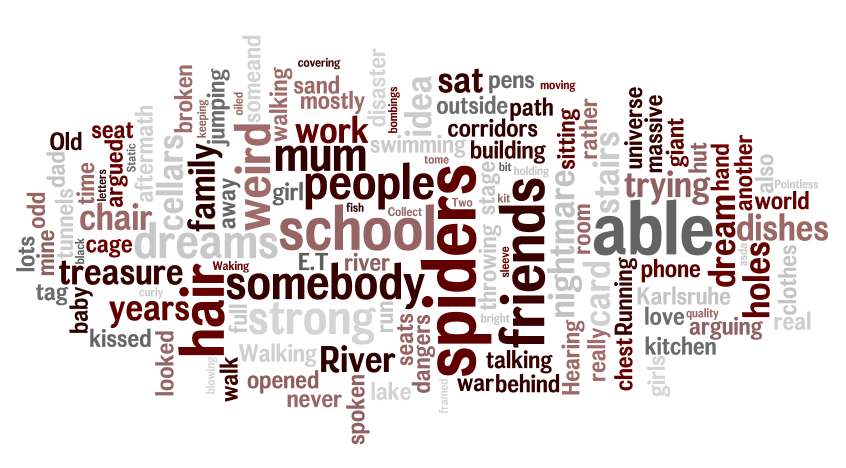

<article id="main">
	<header class="special container">
		
		<h2><strong>Dream</strong> diary</h2>
		
I get <strong title="Sometimes due to my meds. Currently on citalopram 10 and sometimes co-beneldopa 50/100.">lots of</strong> really weird dreams. When I remember I'll make an effort to post them here.

		
Due to the rather private nature of the content, this is an orphan page.

	</header>

	

		<a id="expandList" title="Expand all"><i class="fa fa-angle-double-down fa-2x"></i></a>
		<a id="collapseList" title="Collapse all"><i class="fa fa-angle-double-up fa-2x"></i></a>
	

	<section class="wrapper style4 container">
		

			<section>

<ul id="expList">
	<li id="active">JULY 2014
		<ul>
			<!--
			<li>
				<h3><i class="fa fa-moon"></i> </h3>
				

			</li> -->
			<li>
				<h3><i class="fa fa-spoon"></i> 19 July 14</h3>
				
Hagens place in BB. Leaving them or almost <strong>being kicked out</strong>. Walking home. Somebody new had moved in opposite and had a big <strong>dinner party</strong> on the street. For some reason I was <strong>carrying a pot</strong> with food. A woman walked into me and my food fell into her pot. I said 'great, there goes my dinner, but don't worry you'll be fine - it's vegetarian'.

				
I then entered our old family house. There were two old guys in the living room. They weren't expecting me but I recognised one of them as dad's <strong>friend</strong>. We talked a bit. He sort of suggested he is a very good friend of my dad. It all felt <strong>weird</strong> but very natural.

			</li>
			<li>
				<h3><i class="fa fa-medkit"></i> 18 July 14</h3>
				
I was at Alena's place and lots of family members were there too and we played some sort of game. I fell into a trap on the ground with lots of <strong>spikes</strong>. I hurt myself and had to pretty much help myself out. Alena did not apologise and was angry I was pissed off. I kept being incredibly pissed off. The whole dream was then about me being <strong>angry</strong> and Alena not understanding why. At one point she tried to make me pass out.

				
Alena and my mum and me were walking home from a shop. We were being <strong>followed</strong> by strange people. We hid at home but the strangers then tried to break into Alena's house. She called the <strong>police</strong> and we waited and waited while the strangers were breaking in.

			</li>
			<li>
				<h3><i class="fa fa-signal"></i> 16 July 14</h3>
				
Migi and me were in some sort of school assembly. We were carrying bags. For some reason I knew Migi's bag contained a bomb but I knew it wasn't his. We eventually left and Migi left the bag there. Once we were outside and a bit further away we realised that the <strong>bomb</strong> had exploded and the whole school was on <strong>fire</strong>. The following day we kept going about our business as if nothing had happened. We were in school and some new people joined and seemed to follow us. Somehow I knew they knew it was Migi. The police had also started investigating. I was scared and felt <strong>guilty</strong> for not preventing it even though I kinda knew about the bomb. I thought Migi should talk to the police and explain he didn't know what was in the bag.

				
Me and school mates from Karlsruhe were on a trip to some <strong>ruined temple</strong> in a strange country. Jannie and Leigh were there too. There were stairs everywhere and we were very high up in <strong>mountains</strong>. Leigh and me ran up some stairs to see the <strong>view</strong>. I was slightly concerned about my <strong>breathing</strong>. A group of us then ran even further up where there was some sort of round plateau. It was very grassy. I was taking pictures of the scenery and the people. Gabi too. At times I saw the dream through his <strong>lense</strong>, so saw myself standing and taking pictures. At one point I saw someone flat on the ground and I went to take a <strong>photo</strong> thinking it was Gabi but it was Laura. We ended up talking about culture and <strong>Indian weddings</strong> and Jannie. We walked towards a kitchen (which had appeared out of nowhere sort of underground) which had a very narrow entrance. Laura was inside and I was outside talking to her through the small open entrance gap.

			</li>
			<li>
				<h3><i class="fa fa-beer"></i> 15 July 14</h3>
				
I was on a <strong>train</strong> to Hannover. I don't know were I was travelling from but it was an endlessly long journey and I almost missed my stop in the end. I was looking out of windows a lot and enjoying the <strong>scenery</strong>.

				
Then I was shopping in 'Karlsruhe' (or an imaginery town similar to that) but then suddenly it had a <strong>theme park</strong> feeling with Alena. We were walking around past a beer fest. I was carrying some sort of beanbag. We had to squeeze through a <strong>tunnel</strong> made out of balloon material. I was scared of popping it. At the end of tunnel there was a long long thin bridge. At first it was really fucking high over a valley but then it was over water. There was an element of <strong>game</strong> to it. It would try and make you fall off somehow. Random weird people would jump up from the water and tickle your feet. Alena was in front of me and fell off (and then started climbing back up on a thin thread). There were weird <strong>floating mini fire trucks</strong> which kept rushing past us.

			</li>
			<li>
				<h3><i class="fa fa-tree"></i> 14 July 14</h3>
				
I was with people and we were <strong>driving</strong> to some destination. I was amazed by the scenery and kept trying to take photos. It was dusk and an <strong>aurora</strong> was visible in the sky and generally there was a fantastic sort of Icelandic outlandish <strong>landscape</strong>. I kept taking <strong>pictures</strong>. We were in a small bus of sorts. It was very big though and felt more like a train with me right at the back end with lots of windows all around which allowed me to take these photos. We eventually stoped to look at the aurora properly but suddently entered some sort of <strong>reptile house</strong>. I was wondering around looking through windows to see the sky but then only saw animals. Suddenly komodo dragons were walking over my back. A zoo lady pointed me to salamanders asking me to guess what animals they were. Then I saw a massive crocodile being eaten by a pig. Another zoo lady came immediatly and shot the pig. All the staff of the zoo were then crying over the dead crocodile.

				
I was looking at a <strong>dress</strong> in a shop which had weird sort of hook-y straps.

			</li>
			<li>
				<h3><i class="fa fa-heart"></i> 13 July 14</h3>
				
I was with old friends (including Schweigi) at an old castle type place. He and I kept looking at each other (like we used to) and I then snuck out and he followed me and we started to <strong>kiss</strong> and be all over each other against the wall. Some of the other friends kept making comments about Schweigi finally finding a girl he likes. I then explained on the way (to school?) that he and I have a history (sort of) and that I used to be in love with him for a long time. We kept getting interrupted and couldn't continue kissing but we kept being drawn to each other just like we used to. For some reason I was then walking to school in BB with those friends discussing him.

				
My family and I were camping. Our caravan grounds were being <strong>flooded</strong> and I kept thinking we should move it but my dad was convinced it was alright.

				
I was on a school's sports ground. Students were playing some sort of ball game. I was driving around near the fence with a mini scooter type thing. It was a red-headed girl driving, not me. When we stopped for a moment near a gate another red-headed girl appeared and they started <strong>wrestling on the ground</strong>.

				
I was in a shopping centre looking at <strong>rouge</strong> and trying the colours on the back of my hand. There were some advertisments about not buying makeup while in relationships (WTF?). I didn't care, thinking that since I don't normally wear makeup I'll be ok.

			</li>
			<li>
				<h3><i class="fa fa-bomb"></i> 12 July 14</h3>
				
I was walking along some road and a vehicle running on a single big wheel drove past and shot at us (me and some mystery person) with some sort of <strong>hacking device</strong> that looked a bit like a gun. We distracted them a bit by running back and forth (the device had to 'charge up' somehow) and then stole it and ran away. We then decided to hide it (thinking ourselves really clever and hero-like). Suddenly Tamara was there and we were at some sort of Waldheim place. I kept looking through a window and eventually saw a guy walk away with the device. Two other guys in <strong>Phantom of the Opera costumes</strong> talked about the guy walking away with the device and started pursuing him. For some reason I thought that first guy was going to hide the 'gun' for us and the phantom guys were spies. The device was very powerful and already had all the world's passwords and private hidden info on it. I'm not sure what shooting it would actually acomplish.

				
I was living in a friends house (Maggy) who was always out with friends herself. Me and some other person (Migi perhaps) lounged in the bedroom on the <strong>floor covered with duvets</strong>. My Mum was playing computer games in the background. We were eating crisps.

				
Then suddenly I was at an airport waiting for a <strong>flight</strong> but all our passports had disappeared. Children were ok to fly without apparently. But I was stuck and spent time walking along long long airport corridors.

			</li>
			<li>
				<h3><i class="fa fa-university"></i> 08 July 14</h3>
				
I was with a group of people entering some sort of <strong>temple</strong>. There was a big entrance hall and I stood right infront of the inner gate looking up at the decorations on the wall above the door. I got a bit dizzy as my <strong>vision morphed</strong> weirdly. A guy in the group noticed me swaying and grabed me and guided me inside. Walking into the inner chamber required you to do certain praying like movements while slowly moving. There were rows of cloth (not carpets) on the ground for people to sit on. I did those movements a few times to pay my respects and then decided it was ok to stop and try to find a good place to sit. There were vendors selling items on the ground on some cloths. One woman rudely tripped over things. It seemed like there were lots of tourists. Eventually the ceremony started. We all lied down and curled up sideways. People were very close to each other so we were basically spooning each other. First to the right and then to the left. Suddenly the guy on my left side (Jack from Lost) started having <strong>seizures and died</strong> in my arms. I cried a lot. The next part of the ceremony suddenly involved everybody sitting in a big circle and a young <strong>living deity</strong> walked around and if it pleased him he spoke to a person or blessed them in some way. He looked at me and started talking about a <strong>baby</strong>, asking me what name I have picked. I said I didn't and he started wailing and crying with me. He then kissed me on the lips over and over as a form of blessing. I kept <strong>crying</strong>. The guy who had helped me earlier seemed very concerned for me but stayed away.

				
I was driving around on <strong>motorcycle</strong> with somebody along fields.

				
I was in some sort of holiday resort. I was walking along the beach <strong>naked</strong> with a thin piece of cloth. It felt like I was advertising myself, looking for customers. Then I went inside and saw a <strong>steamroom</strong> area downstairs. A goodlooking woman washed me before going in. She disappeared quickly and I looked around. There were several cubicles, each their own steamroom. The doors were slightly seethrough and I could see people inside fucking. Eventually I found the woman and joined her.

			</li>
			<li>
				<h3><i class="fa fa-paw"></i> 06 July 14</h3>
				
Undis with me in BB. Being dedicated and totally commited to me after one simple kiss. He was lovely but this all was very weird. We were in my old room upstairs (not the cellar room). There was some sort of parade outside. The family car was outisde the garage and neighbours had complained so it needed to be moved. The neighbours opposite were part of some sort of <strong>Fastnacht</strong> society. Undis moved the car but parked it a bit away and I explained he can just park just opposite on the road. My dad was trying to send us to do something (it turned out to be <strong>burning alcohol</strong> he had stored and saved for years).

				
There was also some sort of  amusement event going on in our building's cellar. So Undis and me were queuing. We found out the event was about <strong>'cats with remote controls'</strong> to control their mood and behaviour. They were robot cats and looked horrible but people thought they were real with brain implants. Undis put something into my family's flat, he jumped queue a bit to get in (the door was open) and people complained but he then came back and explained what he did. He was really responsible and trustworthy. There were lots of cars and people parading outside.

			</li>
			<li>
				<h3><i class="fa fa-car"></i> 03 July 14</h3>
				
My mum and sisters were on the road somewhere in a forest. There was a massive <strong>construction site</strong>, it looked like they were digging tunnels. Everything looked very earthy with lots of rocks. Then in the middle of nowhere there was a hotel next to a shop and we stayed there. They had <strong>awesome rooms</strong> - way beyond what we could afford but for some reason we were staying there regardless. Alena and me then moved furniture around, desks and sofa chairs while our mum was sleeping in her room. I then went to call our dad on one of my old phones that was barely working and the reception was crap so I had to go outside. The rooms had several doors one leading directly to the hotel pool and gym with bars and shops.

				
Then suddenly I was in a <strong>Porsche</strong> with a guy driving around in BB. He took the small and very very <strong>steep road</strong> up to the church from the market square. It had small steps and eventually got so steep I asked him if he was sure if he can drive up there. He was convinced but we then fell down the road in the car and luckily survived without much harm. He then drove around on the square looking for a road out. Eventually we got near the <strong>lake</strong> and suddenly stood there and the car was gone. There were some school kids "handing in homework" by throwing it into the lake with the teachers standing next to them nodding. One girl jumped into the lake to fetch her work.

				
Then I was suddenly on a big farm house on a small hill. The house belonged to the Grosskopf family. They had 8 children (not in real life). I was playing with clay making <strong>small figurines</strong> that looked like feet. I tried to find them to perfect them before we burn them, so I ran through the whole house and garden looking for them. The youngest girls were following me and I kept trying to remember their names.

			</li>
		</ul>
	</li>
	<li>JUNE 2014
		<ul>
			<li>
 
				

			</li>
			<li>
				<h3><i class="fa fa-warning"></i> 30 June 14</h3>
				
I was in the <strong>cinema</strong> and many seats had reservations in the form blow up animals covering the reserved seats. My aunt Tamara was there "coordinating" something and asking me to check the <strong>dangers of tunnels</strong> on my phone. Suddenly I was in a hut in a valley with strong strong <strong>sandy winds</strong> blowing. I'm thinking this must be one of the dangers of tunnels. I was holding a massive old tome (which was my phone) to cover myself from the sand. I thought it would give the book charm when it's covered in sand. We then had coffee made in a large chemistry set. The windows of the hut were broken.

			</li>
			<li>
				<h3><i class="fa fa-wheelchair"></i> 29 June 14</h3>
				
In <strong>wheelchair</strong> at very large shopping centre. Looking for marzipan, a bikini and a small sewing kit to fix a broken sleeve of the top I was wearing.

			</li>
			<li>
				<h3><i class="fa fa-camera"></i> 28 June 2014</h3>
				
<strong>Amusement park</strong>. Alena there. A person like Markus 2 there. Me photographing the scenery and sky and people. Shitty old <strong>camera</strong>. Rollercoaster with Markus. Over a lake. On the way out at the edge of a forest we queue for returning keys or something and a massive <strong>empty cage</strong> opens. We wonder if they keep humans in that cage sometimes.

			</li>
			<li>
				<h3><i class="fa fa-medkit"></i> 17 June 2014</h3>
				
Old home in BB with family. I was <strong>throwing up</strong> a lot. First my dad, then my mum then Alena then Jannie all argued with me. My mum also argued with Alena in between. I was trying to <strong>clean</strong> dishes but kept throwing up into the sink or on the dishes or the floor or anywhere. People kept piling laundry in the kitchen so I started <strong>arguing</strong> about me wanting to do the dishes first. At one point I threw up on my laptop and it went inside it so I put it in my old room I once shared with Alena. Some stuff they were arguing to me about: cloth, money. I threw up little <strong>fish</strong> at one point (we were swimming in a lake full of plants earlier). I opened the <strong>postbox</strong> at one point too and all letters had been blatantly opened. At one point also one of my mums friends walked in a started telling her that her next door neighbour is actually somebody she knows from work for years.

			</li>
			<li>
				<h3><i class="fa fa-eye"></i> 15 June 2014</h3>
				
River <strong>waterskiing</strong> in half circle, attached by rope. Alena there.

				
River gigantic cudgel bridg. Eva <strong>giant</strong> coming up the river. I was with bad girl who could transform into giant and had <strong>glowing eyes</strong>. She took me in her hand.

				
Walking along a road past characters next to a guy. Anime intro like. Ended up at the <strong>end of the world</strong> jumping onto fragments over emptyness.

				
Pub on river with mum and somebody else. Looking for <strong>veggy food</strong>. Owner complained about meat eater customers who complain about sittings next to veggies. I had a <strong>card</strong> from Benni. Wow card? Times written on it. Price tag on the front. I oiled it but ran out. Mum rubbed the card on her chest and price tag came off leaving a mark.

			</li>
			<li>
				<h3><i class="fa fa-trophy"></i> ?? June 2014</h3>
				
<strong>Game</strong>? With family. Collect treasure boxes - they contained jade hair ornaments etc. Half virtual reality half real. Very large world. I had a <strong>kitchen sponge</strong> thing as weapon and I was killing <strong>spiders</strong>. The spiders crawled onto my hand though.  
				Corinna - two <strong>record players</strong>. One was reversed- from middle to outside

			</li>
			<li>
				<h3><i class="fa fa-child"></i> 07 June 2014</h3>
				
Yet another dream about moving into a new (really dirty and run down brick-) <strong>house</strong> with my family and me in my new room. Then suddenly I was walking outside with some noname people and there was <strong>war</strong> for some reason and somebody gave me a <strong>newborn baby</strong> through a tiny window and we walked away. The baby was naked and I tried to keep it warm by wrapping it to my chest somehow with my clothes.

			</li>
		</ul> <!-- June 2014 -->
	</li>
	<li>MAY 2014
		<ul>
			<li>
				<h3><i class="fa fa-wheelchair"></i> 14 May 2014</h3>
				
I had a 'nightmare' about not being able to walk again. My legs just weren't strong enough and I collapsed and tried to <strong>crawl</strong> but didn't work. For some reason I was in my old old <strong>school</strong> building.

			</li>
		</ul> <!-- May 2014 -->
	</li>
	<li>APRIL 2014
		<ul>
			<li>
				<h3><i class="fa fa-pencil"></i> 13 April 2014</h3>
				
Marathon? or <strong>festival</strong> with tents and mud and wellies and shorts. Lots of bright green <strong>pens</strong> stuck in the ground around the fence or near the path with a few odd brown pens. Old friends from the area I grew up (Silke, Bernd, Marijke) swimming pool. River I jumped in. Storm. Walking along a motorway to a supermarket. Looking for shorts/short leggings to buy (asda quality awesomeness for ￡3). Buying beer for Migi who was waiting in the staircase and who I met randomly. Alena was there trying on <strong>clothes</strong> with me. Hills. A stage with incredibly weird mini-short-displays of weird stage deco and a projection of sorts. Supposedly meant to be arty but looked like a cheap kindergarten production. Tomoyuki was there and we talked about research and work. Silke kept interrupting me talking about her elusive dad.

			</li>
			<li>
				<h3><i class="fa fa-globe"></i> 06 April 2014</h3>
				
I walked into the classroom at <strong>school</strong>. (My old school before Karlsruhe) I sat down on my seat and then realised that I was sitting on my neighbours seat. So I got up and looked around and my chair was some place else. Later on in the next break I approached her (the girl in whose chair I sat first) and said "Sorry I sat in your chair. In the <strong>universe</strong> I come from, I used to sit right next to you here and we were friends. But in this universe it seems I'm sitting over there".

			</li>
			<li>
				<h3><i class="fa fa-bug"></i> ?? April 2014</h3>
				
Me and three girlfriends (2 from my old school and 1 from the one in Karlsruhe - all of them not actually friends of mine, just some girls I knew from then) were on a strange sort of Indiana Jones type trip somewhere with only one kinda path ahead and lots and lots of traps. The kind of thing Indy would encounter right before finding the <strong>treasure</strong>. No idea what we were doing. It felt like we didn't want to be there, so I don't think we were treasure hunting. More like somebody had dropped us into this nightmare for no reason. I was <strong>struggling</strong> a lot all the time. Not keeping up, not being flexible enough, not strong enough... Two of the other girls had <strong>bugs</strong> in their ears. They sort of tried to help me along but it was hard and I knew they would leave me behind if necessary.

			</li>
		</ul> <!-- April 2014 -->
	</li>
	<li>MARCH 2014
		<ul>
			<li>
				<h3><i class="fa fa-home"></i> 13 March 2014</h3>
				
It included my first love and some sort of <strong>disaster</strong>, running around trying to find survivors, we were sort of trapped in a building. He was just there watching me like he used to.

			</li>
		</ul> <!-- March 2014 -->
	</li>
	<li>FEBRUARY 2014
		<ul>
			<li>
				<h3><i class="fa fa-scissors"></i> 28 February 2014</h3>
				
There was hair! Something about <strong>hair</strong>. Maybe I cut mine? But it was curly? Not sure. The other odd bit was that I was kissing one of my school mates (Mulski) a lot.

			</li>
		</ul> <!-- Feb 2014 -->
	</li>
</ul>

			</section>
		

	</section>

	
	<header class="special container">
		
		<h2>Recurring <strong>Themes</strong></h2>
	</header>

	<section class="wrapper style1 container special" style="background: white;">
		

			<section>
				

					

						<section>
							<header>
								<h3>TV Static</h3>
							</header>
							
Being one pixel of many. Loss of control. Patterns emerging from randomness. Noise. Zooming in, eventually everything merging into one blob of black.

						</section>
					

					

						<section>
							<header>
								<h3>Motion/Motionless</h3>
							</header>
							
Running or walking away but not being able to move. Motion exists but becomes slower and harder over time.

						</section>
					

					

						<section>
							<header>
								<h3>Jumping/Flying</h3>
							</header>
							
Rather than flying being able jump very far and very high. Running along the car and jumping over any obstacles or other cars.

						</section>
					

				

				

					

						<section>
							<header>
								<h3>Holes</h3>
							</header>
							
Finding and falling down holes in the garden. Falling down endless holes.

						</section>
					

					

						<section>
							<header>
								<h3>Magic Realms</h3>
							</header>
							
Stepping through mirrors, holes or portals to another realm. Long corridors full of framed pictures depicting fairy tale scenes. Labyrinths. Losing my sister in those realms.

						</section>
					

					

						<section>
							<header>
								<h3>Photography</h3>
							</header>
							
Taking pictures of landscapes or people. Framing scenery. Focusing. Looking through a lense.

						</section>
					

				

				

					

						<section>
							<header>
								<h3>Ghosts/Voices</h3>
							</header>
							
Hallucinations again. Hearing my mother call for me. Hearing alarm clocks. Seeing and talking to "gestalten". Waking up from being spoken to or called for by ghosts.

						</section>
					

					

						<section>
							<header>
								<h3>Spiders/Cellars</h3>
							</header>
							
Size never exaggerated just normal. Being overrun by spiders. Finding spiders in cellars. Exploring cellars with maze like rooms and corridors and of course spiders in them.

						</section>
					

					

						<section>
							<header>
								<h3>Stairs/Doors</h3>
							</header>
							
Endless stairs. Pointless stairs (stairs going nowhere). Stairs into cellars or attics. Opening doors with unknown behind. Finding spiders or dead people or E.T.

						</section>
					

				

				

					

						<section>
							<header>
								<h3>Disasters</h3>
							</header>
							
Airplane crashing on my location with me in the middle of the aftermath. Nuclear disaster with me in the aftermath. Sudden war with me in the middle of bombings.

						</section>
					

					

						<section>
							<header>
								<h3>Disability</h3>
							</header>
							
Not being able to speak. Not being able to walk. Or more subtle, like not being able to sing or run or dance.

						</section>
					

					

						<section>
							<header>
								<h3>Death</h3>
							</header>
							
Celine dying in various ways, accidents usually rather than suicide. Sometimes my mum dies but mostly Celine. Just seeing corpses of no-face people in my dreams.

						</section>
					

				

				

					

						<section>
							<header>
								<h3>E.T.</h3>
							</header>
							
He used to watch me, that's all. No idea why I perceived him as I nightmare, this is mostly hallucinations too rather than dreams.

						</section>
					

				

			</section>
		

	</section>
</article>
